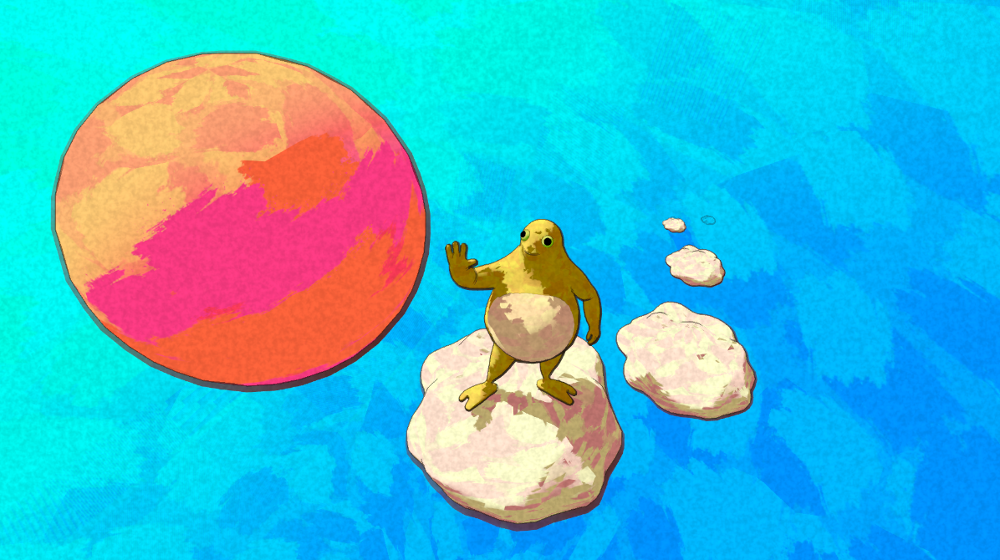
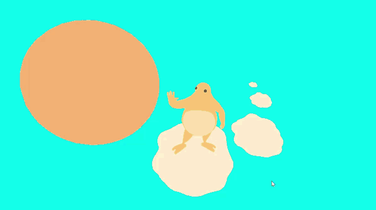
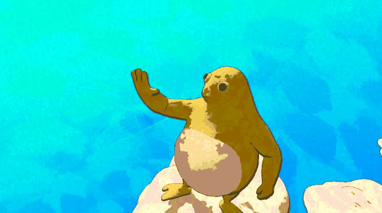
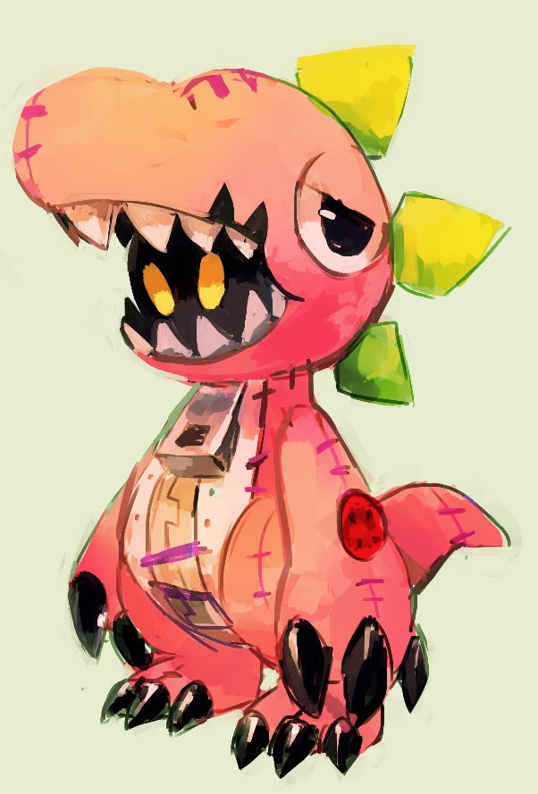

The base paint texture is built by placing brush marks at fixed points sampled from Poisson disks in UV space. The marks follow the model's UV layout, so they stay attached to its surface as it moves. I enhanced the brush texture by randomizing the brush color based on the same base color through an analogous color picker, while artists can choose how analogous the colors are along the color ring. Shadow rings use the same brush texture along transitions from dark to light. The boundary between bright and shadowed areas is also sampled through a Poisson disk, but the lighting is then calculated to determine valid points we can use to cover the edges. The same color-choosing algorithm is then applied to the color.

The outline shader uses a slightly expanded shell around the model to create its outer contour. The line changes in thickness and opacity according to how the surface faces the main light: surfaces facing the light have thinner, more transparent outlines, while surfaces facing away have thicker, more opaque outlines. Uneven offsets give the contour a less uniform appearance.

I also added a paper texture that adds grain and a subtle tint over the painted surfaces and outlines, making the scene feel like a single illustration on paper. The grain stays fixed on the screen, and its scale and strength can be adjusted to control how strongly the paper shows through.

Final scene

Material stage demo — click the preview to open the original video.

Scene rotation — click the preview to open the original video.

Visual reference: [Pinterest](https://www.pinterest.com/pin/417920040419622717/).

